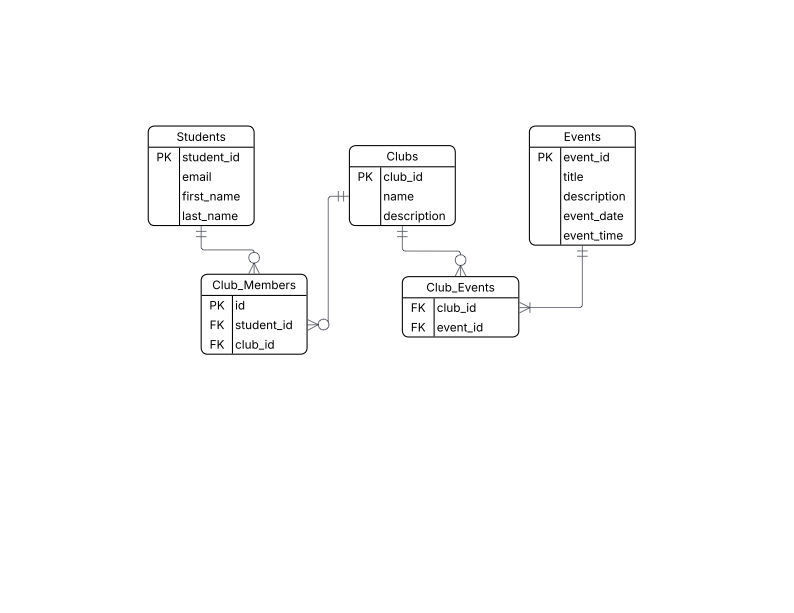

# Gonzaga University Club Tracker

A Streamlit web app for tracking student club memberships and events at Gonzaga University.

## ERD



## Tables

- **students** — stores student first name, last name, and email
- **clubs** — stores club name and description
- **club_members** — junction table linking students to clubs (many-to-many)
- **events** — stores event title, description, date, and location
- **event_clubs** — junction table linking events to clubs (many-to-many)

## How to Run Locally

1. Clone the repo
2. Install dependencies: `pip install -r requirements.txt`
3. Create `.streamlit/secrets.toml` and add your database URL:
```toml
   DB_URL = "your-database-url-here"
```
4. Run the app: `streamlit run streamlit_app.py`

## Live App

(https://appapppy-dncg437ttmnxaqzhsfssaa.streamlit.app/)
